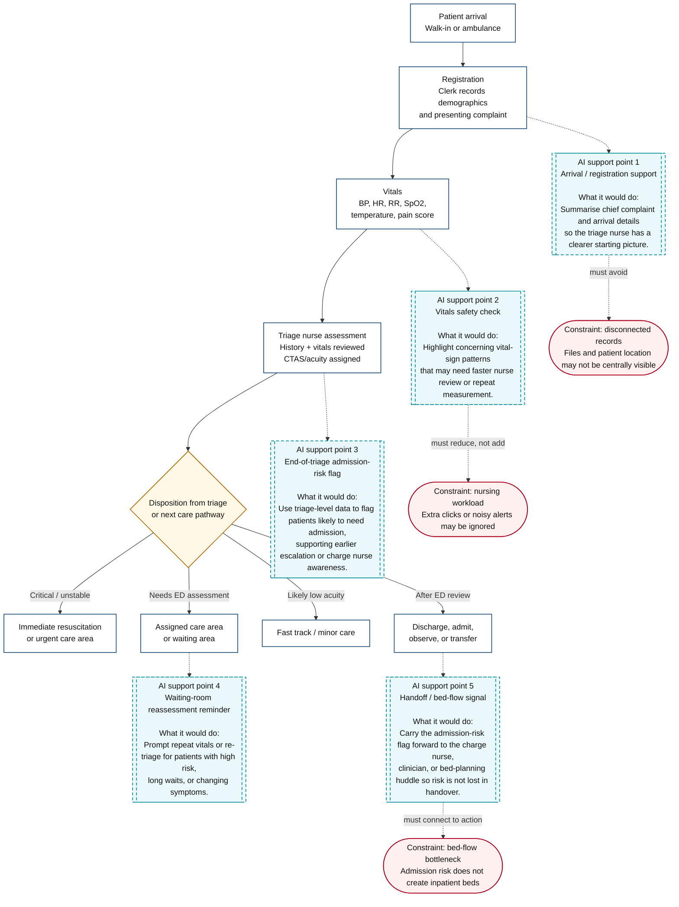

# CariSurg Portfolio

**AI-assisted emergency department triage project using synthetic clinical data.**

## About

This 12-week CariSurg MedTech Pathways pilot focuses on developing an AI-assisted emergency department triage tool in a Caribbean context, where triage decisions often rely on manual clinical judgement.

The project currently uses de-identified Mercer General emergency department data, with plans to expand to a larger dataset as the pilot develops. This repository organises Week 0 notebooks, Week 0 deliverables, and Weeks 1 and 2 research proposal documents in one place for future project work.

## Purpose

The purpose of this repository is to organise the project materials in a clear, reproducible, and reviewable format.

## Installation

To run the notebooks locally, clone the repository and install the required packages:

```bash
git clone https://github.com/tinadams/carisurg-portfolio.git
cd carisurg-portfolio
python -m venv .venv
source .venv/bin/activate  # On Windows: .venv\Scripts\activate
pip install -r requirements.txt
```

Requires Python 3.x and Jupyter Notebook, JupyterLab, or Google Colab.

## Usage

The dataset is not included in this repository, you must add it before running the notebooks.

All notebooks currently look for the dataset using this file path:

```python
FILE_PATH = "EmergencyTriageDataset_Reduced_Dirty.csv"
```

This means the CSV file needs to be in the same place where the notebook is being run.

If you are using Google Colab, upload the CSV file into the Colab session before running the notebook.

If you are running the notebooks locally, put the CSV file in the same folder as the notebook, or update the file path if you store it somewhere else.


## Repository Structure

```text
carisurg-portfolio/
├── README.md
├── LICENSE
├── .gitignore
├── requirements.txt
├── notebooks/
│   ├── week_0_day_1_clean_gender_column.ipynb
│   ├── week_0_day_2_clean_fio2_column.ipynb
│   └── week_0_day_3_data_visualisation.ipynb
├── docs/
│   ├── week_0_day_4_Vital_Sign_Description_(BP).pdf
│   ├── week_0_day_5_Vital_Sign_Description_(SpO2).pdf
│   ├── week_0_day_6_Triage_Pseudocode.pdf
│   ├── week_1_proposal.pdf
│   └── week_2_proposal.pdf
├── data/
│   └── README.md
└── src/
    └── README.md
```

## Folder Guide

* `notebooks/` contains Week 0 Jupyter notebooks for clinical data cleaning and visualisation.
* `docs/` contains Week 0 deliverables and Weeks 1 and 2 research proposal documents.
* `data/` is reserved for future dataset storage. The dataset is not currently included in this repository.
* `src/` is reserved for reusable Python modules and scripts that may be developed later in the program.
* `requirements.txt` lists the Python libraries needed to run the notebooks.

## Version Control Workflow

Major edits are made through a feature branch and merged into `main` using a pull request. This keeps the project history clear and supports a more reviewable workflow.

## Contributing

This repository is part of the CariSurg Healthcare AI Program coursework. Contributions are not currently expected but suggestions for improvement are welcome.

## Licence

This project is licensed under the MIT Licence. See `LICENSE` for details.

## ED Triage Workflow Diagram



**Figure 1. ED triage workflow with AI nurse-support plug-in points.**  
*Simplified from De Freitas et al.’s Caribbean ED patient-flow process and adapted for a triage-level admission prediction pilot.*
