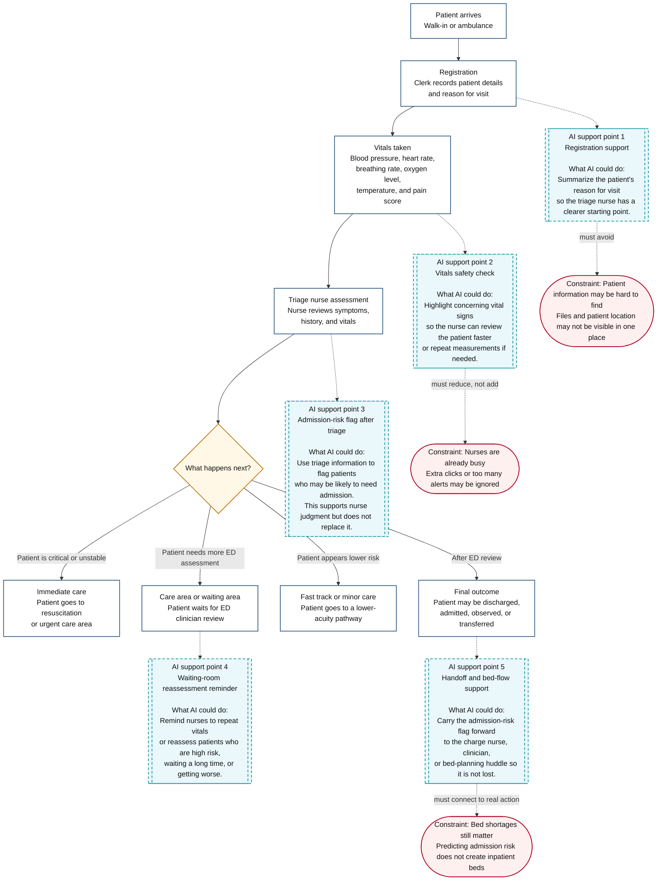

```mermaid
flowchart TD

A[Patient arrives<br/>Walk-in or ambulance] --> B[Registration<br/>Clerk records patient details<br/>and reason for visit]

B --> C[Vitals taken<br/>Blood pressure, heart rate,<br/>breathing rate, oxygen level,<br/>temperature, and pain score]

C --> D[Triage nurse assessment<br/>Nurse reviews symptoms,<br/>history, and vitals]

D --> E{What happens next?}

E -->|Patient is critical or unstable| F[Immediate care<br/>Patient goes to resuscitation<br/>or urgent care area]

E -->|Patient needs more ED assessment| G[Care area or waiting area<br/>Patient waits for ED clinician review]

E -->|Patient appears lower risk| H[Fast track or minor care<br/>Patient goes to a lower-acuity pathway]

E -->|After ED review| I[Final outcome<br/>Patient may be discharged,<br/>admitted, observed, or transferred]

AI1[[AI support point 1<br/>Registration support<br/><br/>What AI could do:<br/>Summarize the patient's reason for visit<br/>so the triage nurse has a clearer starting point.]]

AI2[[AI support point 2<br/>Vitals safety check<br/><br/>What AI could do:<br/>Highlight concerning vital signs<br/>so the nurse can review the patient faster<br/>or repeat measurements if needed.]]

AI3[[AI support point 3<br/>Admission-risk flag after triage<br/><br/>What AI could do:<br/>Use triage information to flag patients<br/>who may be likely to need admission.<br/>This supports nurse judgment but does not replace it.]]

AI4[[AI support point 4<br/>Waiting-room reassessment reminder<br/><br/>What AI could do:<br/>Remind nurses to repeat vitals<br/>or reassess patients who are high risk,<br/>waiting a long time, or getting worse.]]

AI5[[AI support point 5<br/>Handoff and bed-flow support<br/><br/>What AI could do:<br/>Carry the admission-risk flag forward<br/>to the charge nurse, clinician,<br/>or bed-planning huddle so it is not lost.]]

B -.-> AI1
C -.-> AI2
D -.-> AI3
G -.-> AI4
I -.-> AI5

C1([Constraint: Patient information may be hard to find<br/>Files and patient location may not be visible in one place])

C2([Constraint: Nurses are already busy<br/>Extra clicks or too many alerts may be ignored])

C3([Constraint: Bed shortages still matter<br/>Predicting admission risk does not create inpatient beds])

AI1 -. must avoid .-> C1
AI2 -. must reduce, not add .-> C2
AI5 -. must connect to real action .-> C3

classDef process fill:#ffffff,stroke:#1f4e79,stroke-width:1.5px,color:#111;
classDef decision fill:#fff8e6,stroke:#b36b00,stroke-width:1.5px,color:#111;
classDef ai fill:#eaf7fb,stroke:#008c99,stroke-width:1.5px,stroke-dasharray: 6 4,color:#111;
classDef constraint fill:#fff0f0,stroke:#b00020,stroke-width:1.5px,color:#111;

class A,B,C,D,F,G,H,I process;
class E decision;
class AI1,AI2,AI3,AI4,AI5 ai;
class C1,C2,C3 constraint;
```
