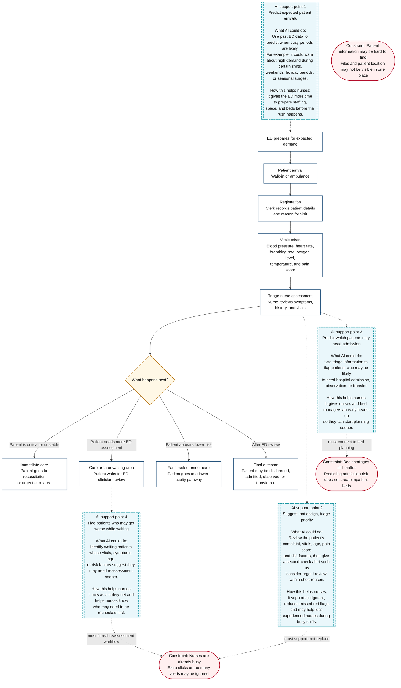

```mermaid
flowchart TD

A[Patient arrival<br/>Walk-in or ambulance] --> B[Registration<br/>Clerk records patient details<br/>and reason for visit]

B --> C[Vitals taken<br/>Blood pressure, heart rate,<br/>breathing rate, oxygen level,<br/>temperature, and pain score]

C --> D[Triage nurse assessment<br/>Nurse reviews symptoms,<br/>history, and vitals]

D --> E{What happens next?}

E -->|Patient is critical or unstable| F[Immediate care<br/>Patient goes to resuscitation<br/>or urgent care area]

E -->|Patient needs more ED assessment| G[Care area or waiting area<br/>Patient waits for ED clinician review]

E -->|Patient appears lower risk| H[Fast track or minor care<br/>Patient goes to a lower-acuity pathway]

E -->|After ED review| I[Final outcome<br/>Patient may be discharged,<br/>admitted, observed, or transferred]

AI1[[AI support point 1<br/>Predict expected patient arrivals<br/><br/>What AI could do:<br/>Use past ED data to predict when busy periods are likely.<br/>For example, it could warn about high demand during certain shifts,<br/>weekends, holiday periods, or seasonal surges.<br/><br/>How this helps nurses:<br/>It gives the ED more time to prepare staffing,<br/>space, and beds before the rush happens.]]

AI2[[AI support point 2<br/>Suggest, not assign, triage priority<br/><br/>What AI could do:<br/>Review the patient's complaint, vitals, age, pain score,<br/>and risk factors, then give a second-check alert such as<br/>'consider urgent review' with a short reason.<br/><br/>How this helps nurses:<br/>It supports judgment, reduces missed red flags,<br/>and may help less experienced nurses during busy shifts.]]

AI3[[AI support point 3<br/>Predict which patients may need admission<br/><br/>What AI could do:<br/>Use triage information to flag patients who may be likely<br/>to need hospital admission, observation, or transfer.<br/><br/>How this helps nurses:<br/>It gives nurses and bed managers an early heads-up<br/>so they can start planning sooner.]]

AI4[[AI support point 4<br/>Flag patients who may get worse while waiting<br/><br/>What AI could do:<br/>Identify waiting patients whose vitals, symptoms, age,<br/>or risk factors suggest they may need reassessment sooner.<br/><br/>How this helps nurses:<br/>It acts as a safety net and helps nurses know<br/>who may need to be rechecked first.]]

PRE[ED prepares for expected demand]

AI1 -.-> PRE
PRE -.-> A
D -.-> AI2
D -.-> AI3
G -.-> AI4

C1([Constraint: Patient information may be hard to find<br/>Files and patient location may not be visible in one place])

C2([Constraint: Nurses are already busy<br/>Extra clicks or too many alerts may be ignored])

C3([Constraint: Bed shortages still matter<br/>Predicting admission risk does not create inpatient beds])

AI2 -. must support, not replace .-> C2
AI3 -. must connect to bed planning .-> C3
AI4 -. must fit real reassessment workflow .-> C2

classDef process fill:#ffffff,stroke:#1f4e79,stroke-width:1.5px,color:#111;
classDef decision fill:#fff8e6,stroke:#b36b00,stroke-width:1.5px,color:#111;
classDef ai fill:#eaf7fb,stroke:#008c99,stroke-width:1.5px,stroke-dasharray: 6 4,color:#111;
classDef constraint fill:#fff0f0,stroke:#b00020,stroke-width:1.5px,color:#111;

class A,B,C,D,F,G,H,I,PRE process;
class E decision;
class AI1,AI2,AI3,AI4 ai;
class C1,C2,C3 constraint;
```
