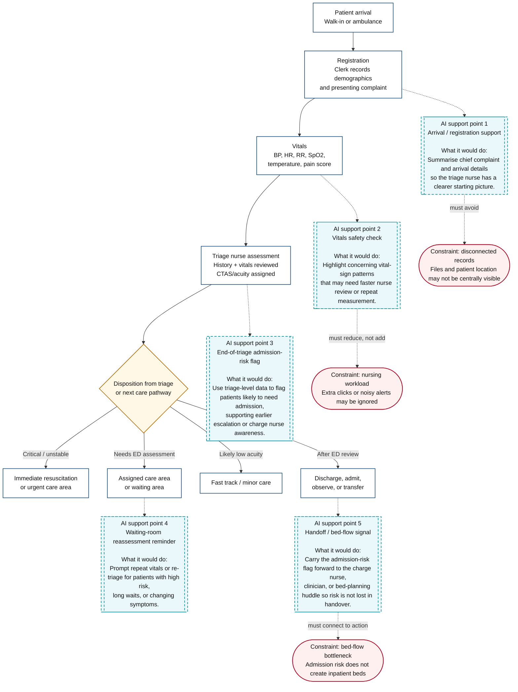

**Figure 1. ED triage workflow with AI nurse-support plug-in points.**  
*Simplified from De Freitas et al.’s Caribbean ED patient-flow process and adapted for a triage-level admission prediction pilot.*
AI1 -. must avoid .-> C1
AI2 -. must reduce, not add .-> C2
AI5 -. must connect to real action .-> C3

classDef process fill:#ffffff,stroke:#1f4e79,stroke-width:1.5px,color:#111;
classDef decision fill:#fff8e6,stroke:#b36b00,stroke-width:1.5px,color:#111;
classDef ai fill:#eaf7fb,stroke:#008c99,stroke-width:1.5px,stroke-dasharray: 6 4,color:#111;
classDef constraint fill:#fff0f0,stroke:#b00020,stroke-width:1.5px,color:#111;

class A,B,C,D,F,G,H,I process;
class E decision;
class AI1,AI2,AI3,AI4,AI5 ai;
class C1,C2,C3 constraint;
```
