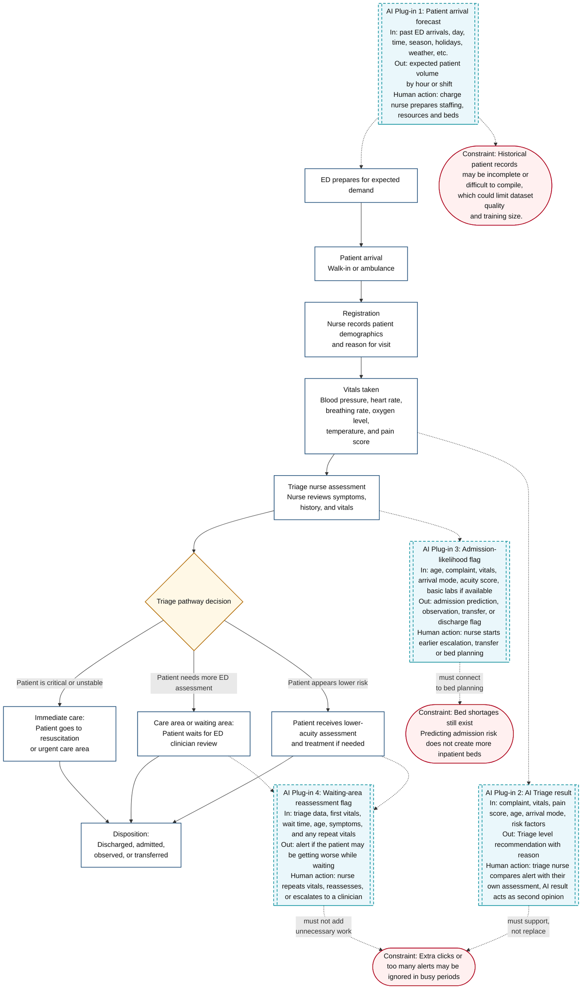

```mermaid
flowchart TD

A[Patient arrival<br/>Walk-in or ambulance] --> B[Registration<br/>Nurse records patient demographics<br/>and reason for visit]

B --> C[Vitals taken<br/>Blood pressure, heart rate,<br/>breathing rate, oxygen level,<br/>temperature, and pain score]

C --> D[Triage nurse assessment<br/>Nurse reviews symptoms,<br/>history, and vitals]

D --> E{Triage pathway decision}

E -->|Patient is critical or unstable| F[Immediate care:<br/>Patient goes to resuscitation<br/>or urgent care area]

E -->|Patient needs more ED assessment| G[Care area or waiting area:<br/>Patient waits for ED clinician review]

E -->|Patient appears lower risk| H[Patient receives lower-acuity assessment<br/>and treatment if needed]

H --> I[Disposition: <br/> Discharged, admitted, <br/> observed, or transferred]

F --> I[Disposition: <br/> Discharged, admitted, <br/> observed, or transferred]

G --> I[Disposition: <br/> Discharged, admitted, <br/> observed, or transferred]

AI1[[AI Plug-in 1: Patient arrival forecast<br/>In: past ED arrivals, day, time, season, holidays, weather, etc.<br/>Out: expected patient volume <br/> by hour or shift<br/>Human action: charge nurse prepares staffing, resources and beds]]

AI2[[AI Plug-in 2: AI Triage result<br/>In: complaint, vitals, pain score, age, arrival mode, risk factors<br/>Out: Triage level recommendation with reason<br/>Human action: triage nurse compares alert with their own assessment, AI result acts as second opinion]]

AI3[[AI Plug-in 3: Admission-likelihood flag<br/>In: age, complaint, vitals, arrival mode, acuity score, basic labs if available<br/>Out: admission prediction, observation, transfer, or discharge flag<br/>Human action: nurse starts earlier escalation, transfer or bed planning]]

AI4[[AI Plug-in 4: Waiting-area reassessment flag<br/>In: triage data, first vitals, wait time, age, symptoms, and any repeat vitals<br/>Out: alert if the patient may be getting worse while waiting<br/>Human action: nurse repeats vitals, reassesses, or escalates to a clinician]]

PRE[ED prepares for expected demand]

AI1 -.-> PRE
PRE --> A
D -.-> AI3
C -.-> AI2
G -.-> AI4
H -.-> AI4

C1([Constraint: Historical patient records <br/> may be incomplete or difficult to compile, <br/> which could limit dataset quality <br/> and training size.])

C2([Constraint: Extra clicks or too many alerts may be ignored in busy periods])

C3([Constraint: Bed shortages still exist<br/>Predicting admission risk does not create more inpatient beds])

AI1 -.-> C1
AI2 -. must support, <br/> not replace .-> C2
AI3 -. must connect <br/> to bed planning .-> C3
AI4 -. must not add <br/> unnecessary work .-> C2

classDef process fill:#ffffff,stroke:#1f4e79,stroke-width:1.5px,color:#111;
classDef decision fill:#fff8e6,stroke:#b36b00,stroke-width:1.5px,color:#111;
classDef ai fill:#eaf7fb,stroke:#008c99,stroke-width:1.5px,stroke-dasharray: 6 4,color:#111;
classDef constraint fill:#fff0f0,stroke:#b00020,stroke-width:1.5px,color:#111;

class A,B,C,D,F,G,H,I,PRE process;
class E decision;
class AI1,AI2,AI3,AI4 ai;
class C1,C2,C3 constraint;
```
