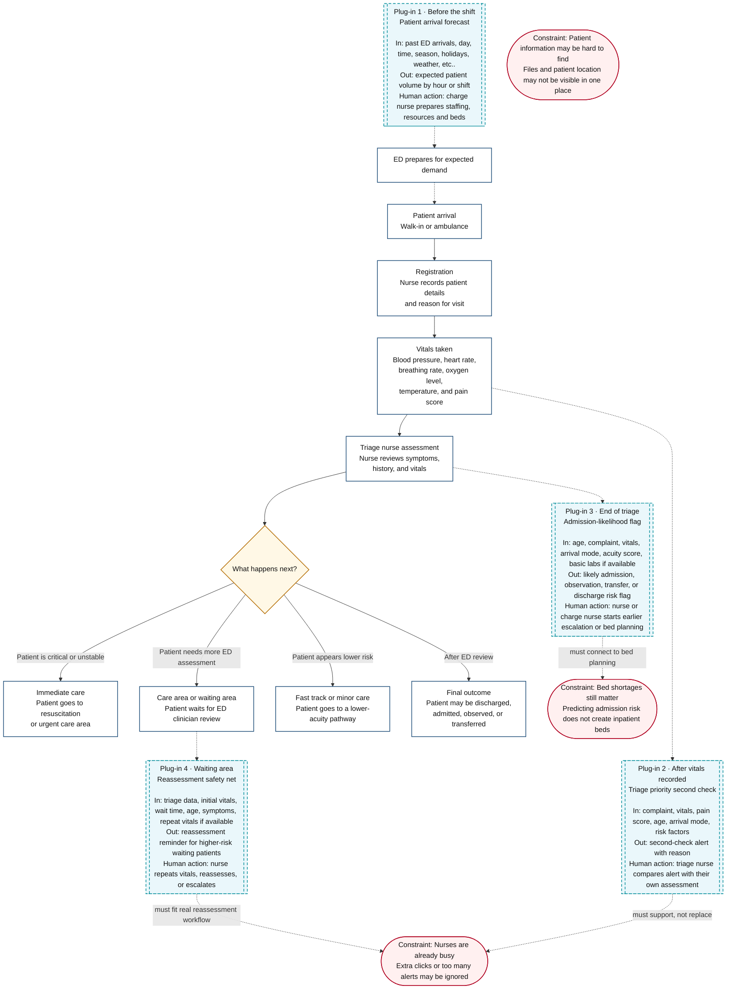

```mermaid
flowchart TD

A[Patient arrival<br/>Walk-in or ambulance] --> B[Registration<br/>Nurse records patient details<br/>and reason for visit]

B --> C[Vitals taken<br/>Blood pressure, heart rate,<br/>breathing rate, oxygen level,<br/>temperature, and pain score]

C --> D[Triage nurse assessment<br/>Nurse reviews symptoms,<br/>history, and vitals]

D --> E{What happens next?}

E -->|Patient is critical or unstable| F[Immediate care<br/>Patient goes to resuscitation<br/>or urgent care area]

E -->|Patient needs more ED assessment| G[Care area or waiting area<br/>Patient waits for ED clinician review]

E -->|Patient appears lower risk| H[Fast track or minor care<br/>Patient goes to a lower-acuity pathway]

E -->|After ED review| I[Final outcome<br/>Patient may be discharged,<br/>admitted, observed, or transferred]

AI1[[Plug-in 1 · Before the shift<br/>Patient arrival forecast<br/><br/>In: past ED arrivals, day, time, season, holidays, weather, etc..<br/>Out: expected patient volume by hour or shift<br/>Human action: charge nurse prepares staffing, resources and beds]]

AI2[[Plug-in 2 · After vitals recorded<br/>Triage priority second check<br/><br/>In: complaint, vitals, pain score, age, arrival mode, risk factors<br/>Out: second-check alert with reason<br/>Human action: triage nurse compares alert with their own assessment]]

AI3[[Plug-in 3 · End of triage<br/>Admission-likelihood flag<br/><br/>In: age, complaint, vitals, arrival mode, acuity score, basic labs if available<br/>Out: likely admission, observation, transfer, or discharge risk flag<br/>Human action: nurse or charge nurse starts earlier escalation or bed planning]]

AI4[[Plug-in 4 · Waiting area<br/>Reassessment safety net<br/><br/>In: triage data, initial vitals, wait time, age, symptoms, repeat vitals if available<br/>Out: reassessment reminder for higher-risk waiting patients<br/>Human action: nurse repeats vitals, reassesses, or escalates]]

PRE[ED prepares for expected demand]

AI1 -.-> PRE
PRE -.-> A
C -.-> AI2
D -.-> AI3
G -.-> AI4

C1([Constraint: Patient information may be hard to find<br/>Files and patient location may not be visible in one place])

C2([Constraint: Nurses are already busy<br/>Extra clicks or too many alerts may be ignored])

C3([Constraint: Bed shortages still matter<br/>Predicting admission risk does not create inpatient beds])

AI2 -. must support, not replace .-> C2
AI3 -. must connect to bed planning .-> C3
AI4 -. must fit real reassessment workflow .-> C2

classDef process fill:#ffffff,stroke:#1f4e79,stroke-width:1.5px,color:#111;
classDef decision fill:#fff8e6,stroke:#b36b00,stroke-width:1.5px,color:#111;
classDef ai fill:#eaf7fb,stroke:#008c99,stroke-width:1.5px,stroke-dasharray: 6 4,color:#111;
classDef constraint fill:#fff0f0,stroke:#b00020,stroke-width:1.5px,color:#111;

class A,B,C,D,F,G,H,I,PRE process;
class E decision;
class AI1,AI2,AI3,AI4 ai;
class C1,C2,C3 constraint;
```
